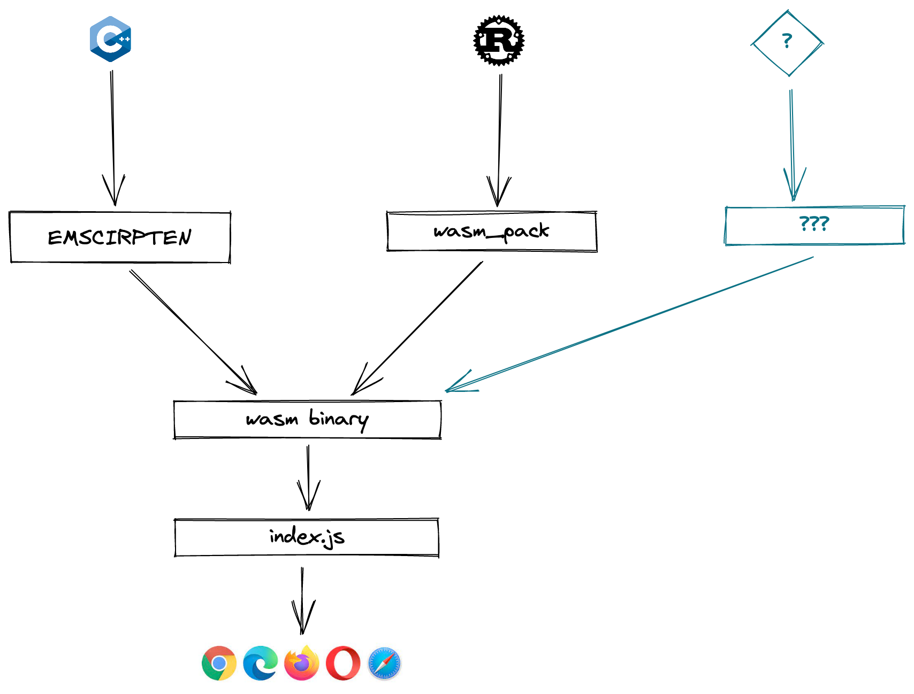

## Comment ça fonctionne ?



De manière très simplifiée, les étapes pour avoir du code de n'importe quel langage, qui soit exécuté par le browser de
façon native, peut se décomposer en 4 étapes :

1. Récupérer/écrire du code (c, c++, rust)
2. Transcrire le code (c, c++, rust) en un binaire Wasm. De nombreux outils sont déjà disponibles
   (emscriptem, wasm_pack)
3. Importer le .wasm dans un fichier JS
4. Utiliser le code (c, c++, rust) dans le navigateur

### Quelques précisions sur l'import en JS

Pour importer un module Wasm dans un fichier JS. La lib standard JS expose le module WebAssembly qui permet de charger
le module Wasm sans trop de code

```javascript
WebAssembly.compileStreaming(fetch('simple.wasm'))
    .then(function (mod) {
        var imports = WebAssembly.Module.imports(mod);
        console.log(imports[0]);
    });
```

Ou en utilisant npm

Avec le lien dans le package.json

```json
{
  "dependencies": {
    "wasm-module": "file:path/to/module"
  }
}

```

Et l'import dans le JS

```javascript
import * as wasm from "wasm-module";

wasm.greet();
```
