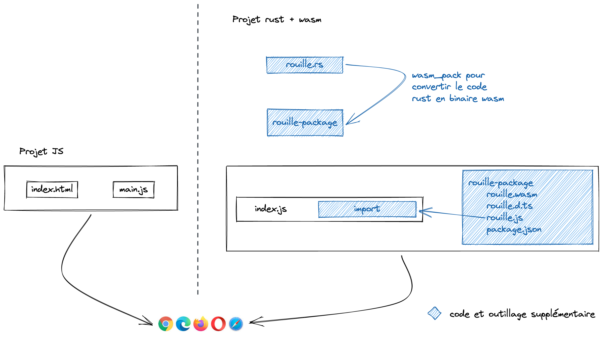

## Ça complexifie le dev web, pourquoi on devrait s'embêter ?

### JS vs Wasm

Comparaison d'un projet JS simple avec un projet qui utilise un module Wasm


Il est assez flagrant que de développer un module Wasm en rust ajoute beaucoup d'étapes et de code sur un projet. Pour
s'en convaincre, il suffit de suivre le tuto
[rust to Wasm](https://developer.mozilla.org/en-US/docs/WebAssembly/Rust_to_wasm) et de regarder le nombre de fichiers
nécéssaires à un simple "hello world"

Voici à quoi ressemble l'arborescence

```text
hello-wasm/
├── Cargo.lock
├── Cargo.toml
├── index.html
├── pkg
│  ├── hello_wasm.d.ts
│  ├── hello_wasm.js
│  ├── hello_wasm_bg.wasm
│  ├── hello_wasm_bg.wasm.d.ts
│  └── package.json
└── src
   └── lib.rs
```

### Pourquoi ?

Bon c'est sûr que si on compare un projet JS avec webpack à un projet rust + Wasm, l'overhead du projet rust + Wasm
paraît plus raisonnable. Mais quand même, pourquoi on s'enmerderait à faire du Wasm alors que ça complexifie le process
de dev.

Qu'est qui justifie d'accepter cette complexité ?

<details>
  <summary>Réponse</summary>

> La vitesse ! Mettez vos lunettes, ça va vite, très très vite
</details>

En gros, Wasm est la réponse quand on a besoin d'avoir un code avec de la computation lourde optimisé aux petits oignons
et que JS ne permet pas d'atteindre le niveau d'optimisation/performance désiré.

L'autre énorme avantage de Wasm est que l'on peut porter un logiciel codé en c++ par exemple directement dans le
navigateur, sans avoir à réécrire tout le logiciel en JS.

Un exemple concret ? [Autocad](https://madewithwebassembly.com/showcase/autocad/)
