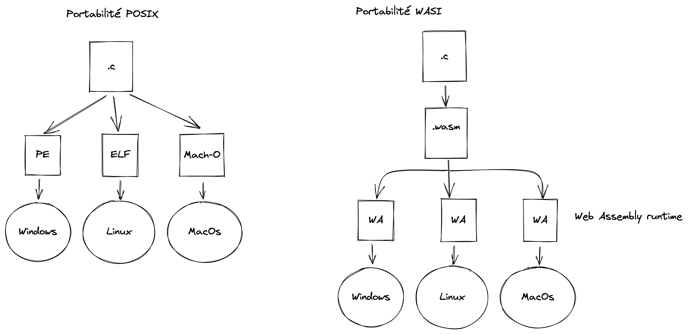

## Vers l'infini et au-delà 🚀 🌌

Wasm permet d'apporter des performances et des optimisations qui ne pouvaient être atteintent jusque là. Et d'un point
de vue portabilité tout se dont on a besoin c'est d'un browser. Alors ça veut dire que l'on peut lancer des programmes
sur n'importe quel machine, même sur des serveurs ?

Eh bien oui, mais à condition qu'il y ait un browser d'installer. Et sur une machine qui n'a pas beaucoup de capacité de
calcul et de mémoire c'est pas si trivial.

Et si on se passait du browser...

### S'abstraire du browser

Comment on enlève le browser ?

Mouais un émulateur, pas fou fou comme solution. Heuresement des gens intelligents se sont dit la même chose et c'est
comme cela qu'est né Web Assembly System Interface (abrégé par WASI)

WASI règle 2 problèmes :

* la portabilité (plus besion de browser)
* la sécurité (avec une interface qui ne donne accès qu'à certaines fonctionnalités du kernel)

### compute@edge 🌐 💻 compute everywhere

Grâce à Wasm et WASI on peut écrire des programmes dans des langages performants et optimisés, et les faire tourner sur
des browsers, des serveurs, des multitudes de devices. Tout ça de manière sécurisé et avec une bonne isolation pour
gérer l'accès aux fonctions du kernel et au filesystem.

Les 4 pilliers du Web Assembly

* fast (plus rapide que docker, boot en nanosecondes)
* small (plus léger que docker)
* portable
* secure (meilleur isolation que docker qui partage le même host)
  et grâce à cela on peut imaginer déployer des programmes partout (client web, server, @edge)

Les conteneurs sont morts vive ~~les conteneurs~~ WASI !

#### exemple d'Amazon avec prime video

Amazon a utilisé Wasm pour cibler plus de **8000 types de devices différents** et améliorer les perfs de prime video au
passage.

> The total memory consumption for the Wasm VM, including the module instance, environment, and the module itself is at most 7.5 megabytes.
> By moving these systems to Wasm, we have saved a total of 30 megabytes of JavaScript heap memory. Memory is a scarce resource on most of
> the devices we deploy on, so this is a welcome reduction.

> The binary size of our Wasm module is 150 kilobytes when compressed (750 kilobytes uncompressed, after symbol stripping).
> The module’s small size, coupled with the fast VM start time, means that the addition of Wasm doesn’t affect the app start-up time.

Pour plus de détails voici
l'[article](https://www.amazon.science/blog/how-prime-video-updates-its-app-for-more-than-8-000-device-types)
