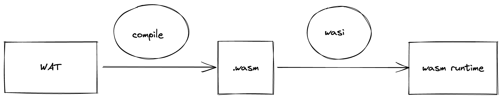
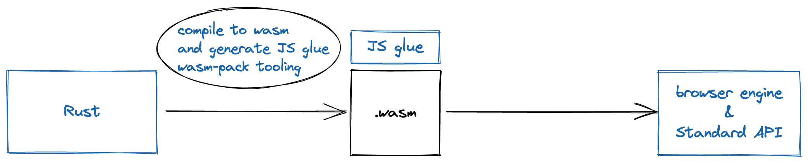
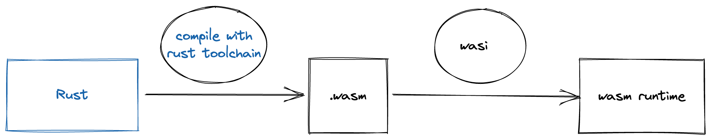

## Synthèse sur l'outillage

### L'outillage autour de wasm

Revenons sur le schéma qui illustre les étapes de compilation

Dans le cas, de l'exemple de code Rust pour la partie browser cela donnerai quelque chose comme ceci

Et pour l'exemple de code Rust sans le browser, voici le schéma

Ce que cela met en lumière, c'est que le process reste globalement le même et que cela n'impacte pas le développeur, à
condition que les outils existent déjà et fonctionnent bien. Dans le cas de Rust, la communauté a fait un boulot
incroyable et cela rend le développement de module wasm en Rust plaisant. Il y a d'autres langages qui sont bien
outillés comme c/c++ avec emscriptem.

Tout cela pour dire que c'est important d'avoir des notions, voire une compréhension totale de ce que sont les acronymes
WAT, WASI, WASM. Mais les outils rendent possibles un certain niveau abstraction et permettent de developer rapidement
des modules qui fonctionnent comme cela a été vu dans les exemples précédents. Pour retrouver, l'intégralité du code des
exemples, il y a un [repo](https://github.com/nitame/mate-rust-wasm) public.

### Pour la suite

Pour la suite, il serait intéressant de descendre encore dans les entrailles de wasm. Sans doute en commençant par
explorer les spécifications du standard et coder en WAT pour mieux comprendre comment le binaire wasm est généré.

Ensuite, peut-être faire un tour du côté du standard WASI et tenté d'implémenter un runtime wasm pour mieux comprendre
les bindings entre wasm et le kernel.