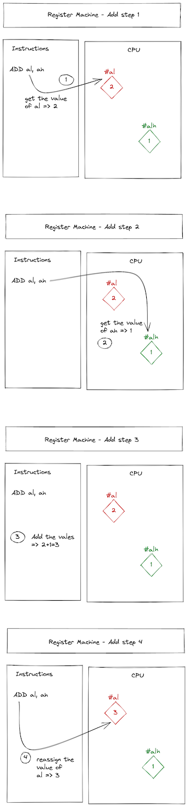
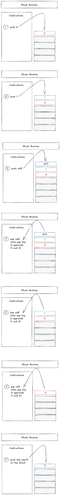
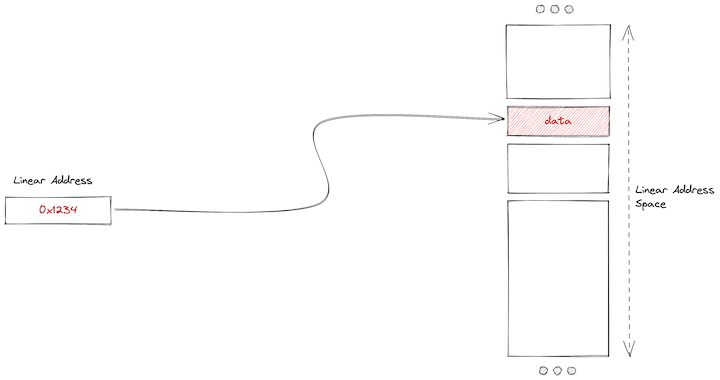
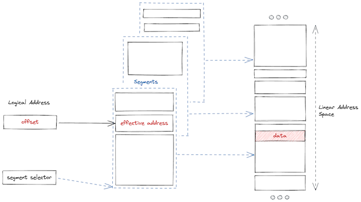

# Notes

## différence entre register machine et stack machine

Register machine regroupe les devices tel que les laptop, smartphone, certain embedded controller. Les instructions sont
exécutées par le processeur et se réfèrent à des données présente sur le CPU.

exemple

````text
ADD al, ah
````

Le processeur va récupérer la valeur contenue par la ref `al`, puis récupérer la valeur contenue par la ref `ah`, puis
additionner les valeurs pour assigner le résultat dans la ref `al`.


Une stack machine se base sur une stack cad un empilement de données et d'instructions. Dans le cas de wasm il s'agit d'
une FIFO(first in first out). Il n'est pas possible de parcourir la stack. On ajoute une donnée/instruction ou on retire
une donnée/instruction.


## wasm control flow

liste des control flow

- if
- else
- loop
- block
- br
- br_if
- br_table
- return
- end
- nop

## linear memory vs segmented memory


linear memory


segmented memory

wasm utilise le model linear memory. Cela signifie qu'il faut gérer l'espace mémoire que l'on veut allouer pour le
programme à la main. La memoire peut être étendue ou rétrécie si nécessaire, mais cela ne se fait pas automatiquement.